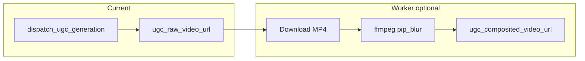

# UGC post-compositing (FFmpeg) and YouTube-style polish

## Implemented in-app (automatic)

After HeyGen or D-ID returns a CDN URL, the Celery worker (see [`worker_tasks.py`](../worker_tasks.py) `_finalize_ugc_with_composite`) optionally:

1. Downloads the provider MP4 into `tasks/<task_id>/ugc_provider_source.mp4`.
2. Runs **FFmpeg** with a **blur-background + bottom picture-in-picture** layout (9:16), writing `tasks/<task_id>/ugc_composited.mp4`.
3. Persists:
   - **`ugc_raw_video_url`** — original provider URL (unchanged).
   - **`ugc_composited_video_url`** — `/task-files/<task_id>/ugc_composited.mp4` when successful, else `null`.
   - **`ugc_composite_note`** — short non-fatal message when composite was skipped or failed (task still completes with raw video).

Service: [`services/ugc_composite_service.py`](../services/ugc_composite_service.py).

### Environment

| Variable | Meaning |
|----------|---------|
| `UGC_FFMPEG_COMPOSITE` | `0` / `false` / `no` / `off` — skip composite entirely. Default: run when `ffmpeg` is on `PATH`. |
| `UGC_FFMPEG_BINARY` | Executable name or path (default: `ffmpeg`). |

**Worker host must have FFmpeg installed** with `libx264` and `aac`. If composite fails, users still get the raw talking-head URL; the UI prefers composited when present (see `ugcPlaybackUrl` in the client).

### Product decisions (locked for this phase)

| Topic | Decision |
|-------|----------|
| Raw vs final URL | **Both**: keep provider URL in `ugc_raw_video_url`; composited path in `ugc_composited_video_url` when FFmpeg succeeds. |
| Background / B-roll source | **Automatic**: derived from the same video (blurred full-frame). No user uploads in this phase. |
| Captions | **Not burned in** in-app. Use manual workflow or upload SRT to YouTube separately. |
| Logo | **Not** overlaid automatically; add in editor or a later iteration. |



---

## Manual workflow (off-tool, YouTube-grade)

Use this when you want **B-roll, music, captions, bumpers**, or finer edit than the automatic blur-bg step.

1. **Download** the finished clip from the app (prefer **הורד** — uses composited file when available, else provider URL).
2. **Editor** (CapCut, DaVinci Resolve, Premiere, etc.): import the MP4.
3. **B-roll**: add screen recordings, product shots, or stock on upper tracks; trim to match beats in the script.
4. **Music**: royalty-cleared track; duck **~12–18 dB** under speech so dialogue stays clear.
5. **Captions**: Hebrew, RTL-aware font; style for Shorts/Reels or YouTube burned-in subtitles.
6. **Brand end card**: logo, URL, or “קישור בתיאור” for the last 2–3 seconds.
7. **Export** platform presets (e.g. 9:16 Shorts / 16:9 long-form) and upload.

---

## Future extensions (not implemented)

- Interleaved **Ken Burns** or hard cuts on stills timed to `ugc_script` scenes.
- **User-uploaded** background images or B-roll URLs (API + storage).
- **ASS/SRT** generation from `spoken_text` and optional burn-in.
- **`chromakey`** if the provider returns green-screen footage.

---

## Schema

- `ugc_composited_video_url` — `String(1024)`, nullable.
- `ugc_composite_note` — `Text`, nullable.

Migration: `alembic/versions/g9b1c2d3e4f5_add_ugc_composite_columns.py`.

If `alembic upgrade` fails with duplicate column `task_kind` (DB already altered manually), run  
`python -m alembic stamp f8a0b1c2d3e4` then `python -m alembic upgrade head`.  
Alternatively, add columns manually:

```sql
ALTER TABLE banner_tasks ADD COLUMN ugc_composited_video_url VARCHAR(1024) NULL;
ALTER TABLE banner_tasks ADD COLUMN ugc_composite_note TEXT NULL;
```
